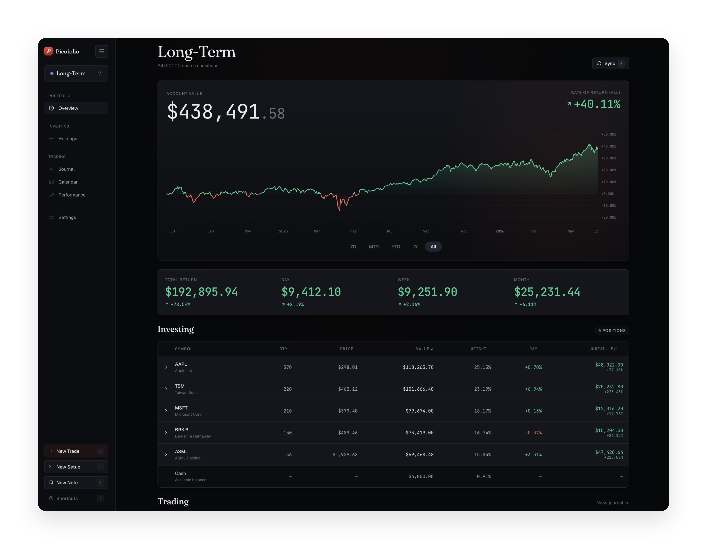
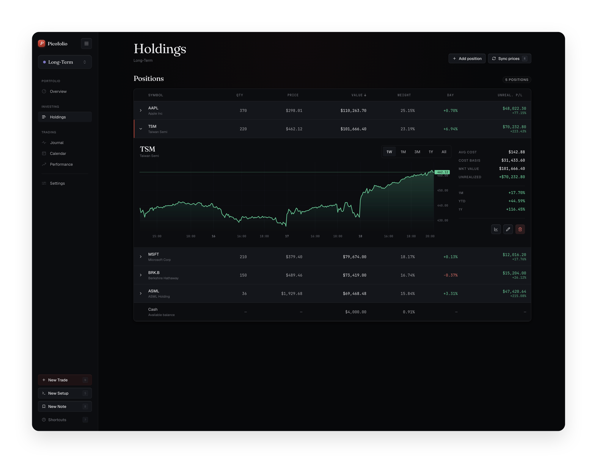

# 📈 Picofolio

A minimal, obsessively-designed desktop portfolio tracker for technical retail investors with an Interactive Brokers account.

It combines a **trading journal** 📓 and a **long-term portfolio overview** 🪙 into one calm, keyboard-first tool. Local-first: your data and your broker credentials never leave your browser. 🔒

> 🎯 Design north stars: Fey (aesthetic), Linear (keyboard-first speed), Raycast (command palette), Bloomberg (numeric density). The bias is always toward restraint — darker, calmer, more typographic.

<!-- Hero screenshot — drop a wide shot of the Overview page at docs/screenshots/overview.png -->


---

## ✨ Features

- 🗂️ **Multi-account** — built for the realistic IBKR setup of one trading account + N long-term accounts. A top-level switcher scopes every view; each account has its own color, cash, contributions, and sync. Full account CRUD.
- 🔌 **IBKR import (BYOK)** — connect via an IBKR **Flex Query** token + Query ID (yours, stored locally). Imports positions, cash, and trade fills, coalescing executions into trades and computing realized P&L from your actual fills.
- 🧮 **Options pricing (BYOK)** — open option positions are marked to market via a free [MarketData.app](https://www.marketdata.app/) token (also yours, stored locally) — a live mark plus a price-history chart. Closed option trades use your IBKR fills, never an external call. The app is fully functional with no token; option charts simply show a calm "add a token" hint.
- 🏷️ **Custom tickers** — add any holding or trade manually by ticker symbol (no broker required), priced live via the public equity feed, with an inline TradingView chart link.
- 📓 **Trading journal** — weekly absolute P&L (rolling bars), a calendar of realized P&L, a sortable trade table with setups/tags, and per-trade charts (intraday + daily).
- 📊 **Holdings** — combined, sortable table with day/unrealized deltas and expandable per-position price charts.
- ⌨️ **Keyboard-first** — `⌘K` command palette (fuzzy search across symbols, accounts, actions), `g`-prefix navigation, and single-key shortcuts throughout.

Everything persists locally (browser storage today); no account, no server, no telemetry. 🙅

## 📸 Screenshots

<!--
Drop PNGs into docs/screenshots/ with these names and they'll render here.
~1600px wide, dark UI. See docs/screenshots/README.txt.
-->

|  |  |
| --- | --- |
| **Overview** — combined value, deltas, allocation | **Holdings** — sortable table + expandable charts |
|  |  |
| **Trading journal** — weekly P&L + trade table | **Calendar** — realized P&L by day |
|  |  |

> 💡 No screenshots yet? Run `pnpm dev` — the app ships with demo data, so every view is alive on first launch.

## 🔒 Local-first — your data never leaves your browser

Picofolio has no backend, no account, and no telemetry. Everything — your positions, trades, journal entries, account setup, and broker credentials — lives entirely in your own browser's local storage. There is no Picofolio server to send it to, and nothing is ever phoned home.

The only network calls the app makes are the ones *you* trigger to *your* data sources: IBKR (with your Flex token), MarketData.app (with your token), and the public equity price feed. Each request goes straight to that service and nowhere else. Tokens are sent only to the service they belong to.

That's the whole point of the local-first design: no server means no incentive to monetize your data, and no data liability means there's nothing to breach. Your portfolio is yours alone. 🙌

## 🔑 Bring-your-own-key, by design

Picofolio talks to two external services, and you supply the credentials for both:

| Data | Source | Token | Required? |
| --- | --- | --- | --- |
| Positions, cash, trade fills, realized P&L | IBKR Flex Query | Flex token + Query ID | For broker sync (manual entry works without it) |
| Equity prices & history | Public market feed | — | No |
| Open-option live mark & history | MarketData.app | Free API token | Only for live option marking |

Tokens are stored locally and sent only to the service they belong to. Add them in **Settings**. (Note: the current build stores secrets in browser local storage — fine for local use; the Tauri desktop build will move them to the OS keychain.)

## 🧱 Stack

- ⚛️ **React 19 + TypeScript** (strict), **Vite**
- 🐻 **Zustand** for state + local persistence
- 📉 **lightweight-charts** for price/value charts
- 🧭 **react-router**, **lucide-react** (icons)
- 🎨 Hand-written CSS driven by design tokens — **no component library** (shadcn/Material/etc.). Custom components are the whole point.

> 🖥️ **Desktop packaging (Tauri) is planned, not yet scaffolded.** Today Picofolio runs as a local-first web app via Vite; the external calls (IBKR, MarketData.app, equity prices) go through the Vite dev proxy. When Tauri lands, those move to typed Rust commands and secrets move to the OS keychain.

## 🚀 Getting started

```bash
pnpm install
pnpm dev          # http://localhost:5173
```

Other scripts:

```bash
pnpm build        # tsc -b && vite build
pnpm typecheck    # tsc -b --noEmit
pnpm preview      # preview the production build
```

The app ships with demo data so the UI is alive immediately. To use real data, open **Settings** and add an IBKR Flex connection (and, optionally, a MarketData.app token for live option pricing).

### 🔌 Getting the tokens

- **IBKR Flex Query** — in IBKR Client Portal: *Performance & Reports → Flex Queries*. Create an Activity/Positions query, then generate a Flex Web Service token. You'll paste the token + the Query ID into Settings.
- **MarketData.app** — sign up at [marketdata.app](https://www.marketdata.app/) (free tier, no card) and paste the token into Settings → Options pricing. Optional.

## ⌨️ Keyboard shortcuts

| Key | Action |
| --- | --- |
| `⌘K` / `Ctrl K` | Command palette |
| `n` | New trade |
| `g o` | Overview |
| `g a` | Activity (journal) |
| `g c` | Calendar |
| `g h` | Holdings |
| `g s` | Settings |

## 🎨 Design system

The design system is the heart of the project. Single source of truth: [`src/styles/tokens.css`](src/styles/tokens.css) and [`src/styles/primitives.css`](src/styles/primitives.css). A static reference page lives at [`docs/showcase.html`](docs/showcase.html) — open it in a browser to see the tokens composed into the actual UI.

The full design & engineering contract is in [`CLAUDE.md`](CLAUDE.md): color and typography rules, the chiaroscuro lighting approach, motion/easing, density philosophy, and the locked product scope.

## 🤝 Contributing

Issues and PRs welcome! Before contributing UI, read [`CLAUDE.md`](CLAUDE.md) — it defines the bar (tokens-only, tabular numerics, custom components, designed error states). Code conventions: TypeScript strict (no `any`), functional components, money stored as integer cents, dates as ISO-8601 UTC.

## 📄 License

[GNU AGPL-3.0](LICENSE). You may use, study, modify, and self-host Picofolio freely. If you run a modified version as a network service, you must make your source available under the same license. © 2026 Picofolio contributors.
